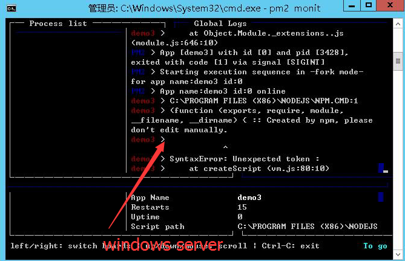
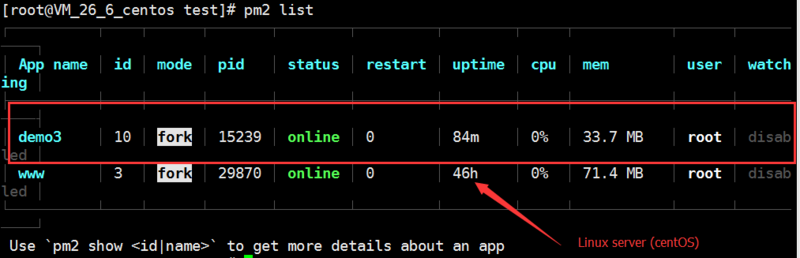

# 部署方式

## 基础模板的部署方式

### 第一步，打包

在执行`npm run build`的时候，`nuxt`会自动打包

### 第二步，选择要部署的文件：

- `.nuxt/`文件夹
- `package.json`文件
- `nuxt.config.js`文件(如果你部署一些proxy，则需要上传这个文件，个人建议把它传上去)

### 第三步，启动你的`nuxt`(重要)

使用`pm2`启动你的`nuxt.js`

```sh
$ pm2 start npm --name "demo" -- run start
```

**在这里，我发现个问题，如果你使用`window server` 服务器，在使用`pm2`启动时候，会出现错误，错误如下：**



**如果在`Linux`服务器下启动，同样的命令，同样的执行，则不会出现错误：**
**这里采用`Linux CentOS 7`**



而在linux服务器上，我们可以使用如下方式进行启动:

```shell
$ pm2 start npm --name "demo" -- run start
```

## Express / koa2 启动方式

所以，个人建议，在采用初始化模板的时候，请选用`express` 或者 `koa` 进行初始化，理由如下：

### 1.选择要部署的文件

- `.nuxt/`文件夹
- `package.json`文件
- `build/`文件夹
- `nuxt.config.js`文件(如果你部署一些proxy，则需要上传这个文件，个人建议把它传上去)

### 采用基础模板初始化，观察`package.json`的启动方式如下：

```js{3,4}
"scripts": {
    "dev": "nuxt",
    "build": "nuxt build",
    "start": "nuxt start",
    "generate": "nuxt generate",
    "lint": "eslint --ext .js,.vue --ignore-path .gitignore .",
    "precommit": "npm run lint"
  }
```

### 采用express/koa初始化模板，观察`package.json`的启动方式如下：

```js{3,4}
"scripts": {
    "dev": "backpack dev",
    "build": "nuxt build && backpack build",
    "start": "cross-env NODE_ENV=production node build/main.js",
    "precommit": "npm run lint",
    "lint": "eslint --ext .js,.vue --ignore-path .gitignore ."
  }
```

在`start`中，对比下，个人觉得`express/koa`更灵活一些，它直接启动了`build/main.js`文件，更能直观的启动方式，而关键在于，也可以在`windows server`下运行起来。

::: warning
注意事项：如果采用`express/koa`的模板初始化，服务器部署的时候，同时要上传`build/`目录！！！
:::
