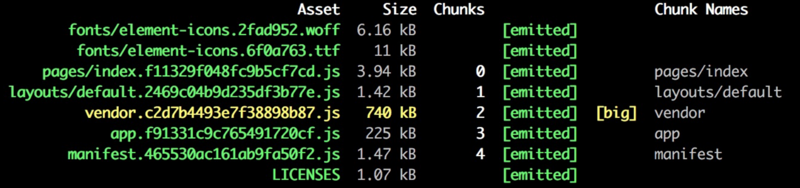
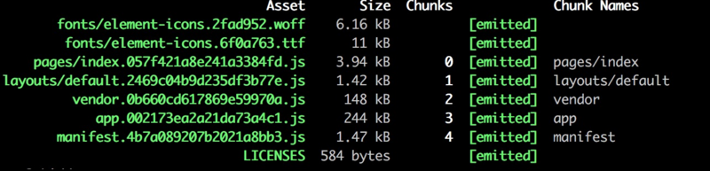

# 按需加载

## Element-UI

我找了很多相关文章，并没有详细说明该如何引入。所以我要拿出来将他说明：

先来看下，如果不按需引入`vendor.js`的体积大小为：



### 第一步，下载依赖：

```shell
# 先下载element-ui

npm install element-ui --save

# 如果使用按需引入，必须安装babel-plugin-component(官网有需要下载说明，此插件根据官网规则不同，安装插件不同)

npm install babel-plugin-component --save-dev
```
安装好以后，按照`nuxt.js`中的规则，你需要在 `plugins/` 目录下创建相应的插件文件

在文件根目录创建(或已经存在)`plugins/`目录，创建名为：`element-ui.js`的文件，内容如下：

```js
import Vue from 'vue'

import { Button } from 'element-ui'    //引入Button按钮

export default ()=>{
    Vue.use(Button)
}
```

### 第二步，引入插件

在`nuxt.config.js`中，添加配置为:`plugins`

```js
css:[
'element-ui/lib/theme-chalk/index.css'
],
plugins:[
'~/plugins/element-ui'
]
```

默认为：开启SSR,采用服务端渲染，也可以**手动配置关闭SSR**，配置为：

```js
css:[
'element-ui/lib/theme-chalk/index.css'
],
plugins:[
    {
        src:'~/plugins/element-ui',
        ssr:false    //关闭ssr
    }
]
```

### 第三步，配置`babel`选项

在`nuxt.config.js`中，配置在`build`选项中，规则为官网规则：

```js

build: {
      babel:{        //配置按需引入规则
          "plugins":[
              [
                  "component",
                  {
                      "libraryName":"element-ui",
                      "styleLibraryName":"theme-chalk"
                  }
              ]
          ]
      },
    /*
     ** Run ESLINT on save
     */
    extend (config, ctx) {
      if (ctx.isClient) {
        config.module.rules.push({
           enforce: 'pre',
           test: /\.(js|vue)$/,
           loader: 'eslint-loader',
           exclude: /(node_modules)/
        })
      }
    }
 }

```

此时，我们在观察**打包以后文件体积大小**，如图：



**此时，我们成功完成了按需引入配置。**

## 待更新

### 其他方式待更新
